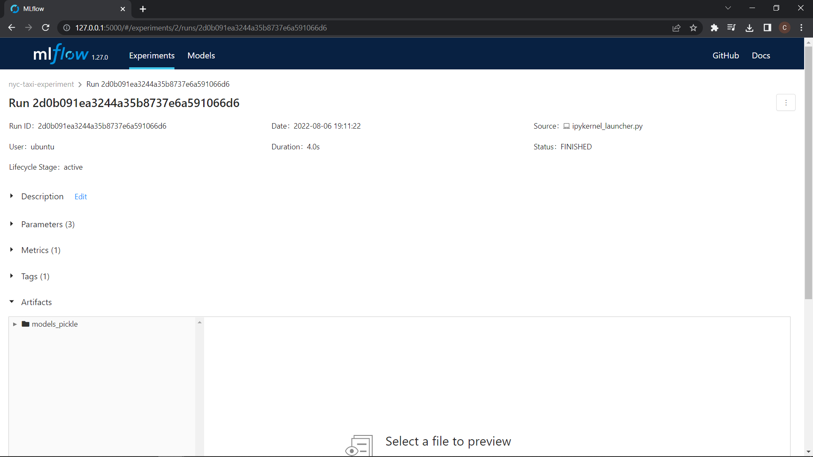
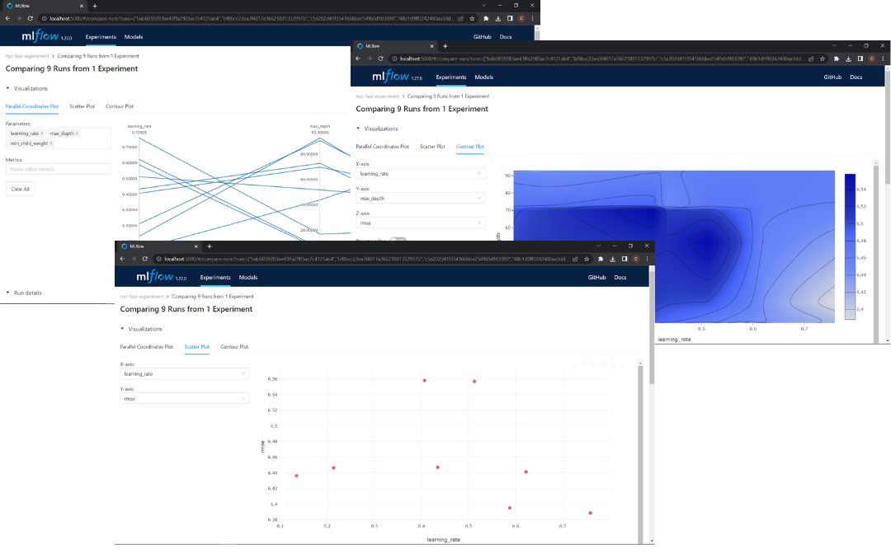

# Introduction to Experiment tracking

## Important concepts

- **ML experiment:** the process of building an ML model; The whole process in which a Data Scientist creates and optimizes a model
- **Experiment run:** each trial in an ML experiment; Each run is within an ML experiment
- **Run artifact:** any file associated with an ML run: Examples include the model itself, package versions...etc; Each Artifact is tied to an Experiment
- **Experiment metadata:** metadata tied to each experiment


## Experiment tracking
Experiment tracking is the process of **keeping track of all the relevant information from an ML experiment**(relevant information depends on the experiment), which includes source code, environment, data, model, hyperparameters, metrics, etc.

Experiment tracking helps with:
- **Reproducibility**
- **Organization**
- **Optimization**

**Note:** Tracking experiments in spreadsheets helps but is not enough because **error prone**, **no standard format**, **no visibility and collaboration**.

## MLflow

# Poner logo de MLflow

*"An Open source platform for the machine learning lifecycle"*

Where ml lifecycle means the whole process of building and maintaining ml models. MLflow is a python package that contains four main modules:
- **Tracking**
- **Models**
- **Model registry**
- **Projects (Out of scope of this notes)**

You can check de official [MLflow Documentation](https://www.mlflow.org/docs/latest/index.html)


# Puede que lo ponga separado el tracking experiment


### Tracking experiments with MLflow:
The MLflow Tracking module allows you to organize your experiments into runs, and to keep track of:
- **Parameters:** Any parameter that affects the model like *hyperparameters*,  *training dataset path*, *preprocessing*, etc.
- **Metrics:** Metrics for training and test dataset
- **Metadata:** For example *tags*
- **Artifacts:** Any file like visualizations
- **Models**

Along with this information, MLflow automatically logs extra information about the run:
- **Source code**
- **Version of the code (git commit)**
- **Start and end time**
- **Author**


Source:

https://github.com/ayoub-berdeddouch/mlops-journey/blob/main/experiment_tracking_02.md

https://www.youtube.com/watch?v=MiA7LQin9c8&list=PL3MmuxUbc_hIUISrluw_A7wDSmfOhErJK


# Getting Started with MLflow
# Aquí va referencia al apendice
You can create a conda environment(Go to Appendix) and install MLlow into it, install with:

```bash
pip install mlflow=1.27
```

MLflow has different interfaces, each with their pros and cons. We introduce the core functionalities of MLflow through the UI.


## MLflow UI:

To run the MLflow UI locally we use the command:

```
mlflow ui --backend-store-uri sqlite:///mlflow.db
```
**Note1:** In the directory you ran the command will be created a `mlruns` directory and `mlflow.db` file.

**Note2:** The backend storage is essential to access the features of MLflow, in this command we use a SQLite backend with the file `mlflow.db` in the current running repository. This URI is also given later to the MLflow Python API `mlflow.set_tracking_uri`.

By accessing the provided local url in the terminal you can access to the UI and you'll see something like this:


In addition to the backend URI, we can also add an artifact root directory where we store the artifacts for runs, this is done by adding a `--default-artifact-root` paramater:

```
mlflow ui --backend-store-uri sqlite:///mlflow.db --default-artifact-root ./mlruns

```

#  FALLLTAAAA MLflow Tracking Client API:

## Tracking a Single Experiment run

In order to track experiment runs, we first initialize the mlflow experiment setting the *tracking uri* and the *experiment* using the code:

```python
import mlflow
mlflow.set_tracking_uri("sqlite:///mlflow.db")
mlflow.set_experiment(EXPERIMENT_NAME)
```

Example:

```python
import mlflow
mlflow.set_tracking_uri("sqlite:///mlflow.db")
mlflow.set_experiment("nyc-taxi-experiment")
```

Where `EXPERIMENT_NAME` is the name of the experiment you want to use(it will be created if doesn't exist')


We can then track a run, we'll use this simple code snippet as a starting point:

```python
alpha = 0.01

lr = Lasso(alpha)
lr.fit(X_train, y_train)

y_pred = lr.predict(X_val)

mean_squared_error(y_val, y_pred, squared = False)
```

We initialize the run using ```with mlflow.start_run():``` and wrapping the whole run inside it. We track the relevant information using  three mlflow commands:

- `set_tag` for Metadata tags
- `log_param` for logging model parameters
- `log_metric` for logging model metrics

In the next example we set:
1. **Metadata tags:** the author name
2. **Log parameters:** training and validation data paths and alpha value
3. **Log metrics:** RMSE

**Note:** The python script or notebooks have to be runned in the same directory as you will run the MLflow UI.

```python
with mlflow.start_run():
    mlflow.set_tag("developer", "Chris")
    
    mlflow.log_param("train-data-path", "data/green_tripdata_2021-01.parquet")
    mlflow.log_param("val-data-path", "data/green_tripdata_2021-02.parquet")
    
    alpha = 0.01
    mlflow.log_param("alpha", alpha)
    lr = Lasso(alpha)
    lr.fit(X_train, y_train)
    
    y_pred = lr.predict(X_val)
    rmse = mean_squared_error(y_val, y_pred, squared = False)
    mlflow.log_metric("rmse", rmse)
```

Now if we run this then in the MLflow UI you'll see a new experiment `nyc-taxi-experiment`and inside it will be a new run with our logged parameters, tag, and metric.


If you click in the time ago fo the run you'll se all the logs.




## Tracking a Multiple Experiment runs(Hyperparameter Optimization)


If you want to track Hyperparameter Optimization you can do a for loop with ```with mlflow.start_run():``` inside and try a different hyperparameters in each iteration, but this is not a efficient way, then we are going to use `hyperopt` this python library use bayesian methods to find the best hyperparameters in a efficient way. If you want to know more about hyperopt you can chek de [Hyperopt Documentation](http://hyperopt.github.io/hyperopt/). We import some classes from `hyperopt`:
- `fmin`: Try to minimize and output(a metric)
- `tpe`: Algorithm to control the logic of the optimization
- `hp`: Include different methods to define the search space
- `STATUS_OK`: Signal to tell hyperopt the objetive function has run successfully
- `Trials`: Keep track information of each run
- `scope`: Define a range of type integer

And now by wrapping the hyperopt Optimization objective inside a with `with mlflow.start_run()` block, we can track every optimization run that was ran by hyperopt. We then log the parameters passed by hyperopt as well as the metric as follows:


```python

import xgboost as xgb

from hyperopt import fmin, tpe, hp, STATUS_OK, Trials
from hyperopt.pyll import scope

train = xgb.DMatrix(X_train, label=y_train)
valid = xgb.DMatrix(X_val, label=y_val)

def objective(params):
    with mlflow.start_run():
        mlflow.set_tag("model", "xgboost")
        mlflow.log_params(params)
        booster = xgb.train(
            params=params,
            dtrain=train,
            num_boost_round=1000,
            evals=[(valid, 'validation')],
            early_stopping_rounds=50
        )
        y_pred = booster.predict(valid)
        rmse = mean_squared_error(y_val, y_pred, squared=False)
        mlflow.log_metric("rmse", rmse)

    return {'loss': rmse, 'status': STATUS_OK}

search_space = {
    'max_depth': scope.int(hp.quniform('max_depth', 4, 100, 1)),
    'learning_rate': hp.loguniform('learning_rate', -3, 0),
    'reg_alpha': hp.loguniform('reg_alpha', -5, -1),
    'reg_lambda': hp.loguniform('reg_lambda', -6, -1),
    'min_child_weight': hp.loguniform('min_child_weight', -1, 3),
    'objective': 'reg:linear',
    'seed': 42
}

best_result = fmin(
    fn=objective,
    space=search_space,
    algo=tpe.suggest,
    max_evals=50,
    trials=Trials()
)

```

In this block, we defined the search space and the objective than ran the optimizer. We wrap the training and validation block inside `with mlflow.start_run()` and log the used parameters using `log_params` and validation RMSE using `log_metric`.

In the UI will be the runs generated by hyperopt, since we use the tag `mlflow.set_tag("model", "xgboost")` you can filter the runs typingin the search section(in the UI):
```bash
tags.model = "xgboost"
```

In the UI you can compare all this runs following **Filter xboost models -> Select all of them -> CLick in Compare** and you will can visualize a Parallel Coordinates Plot, Scatter Plot and Contour Plot.



If you want to know how to read this kind of visualizations you can check this [video](https://youtu.be/iaJz-T7VWec?list=PL3MmuxUbc_hIUISrluw_A7wDSmfOhErJK&t=684)


## Selecting the Best Model

When you select the best model is importan to check not just the performance, is important to check:

- **Performance**
- **Training time**
- **Model Size(Complexity)**

Could be that a model has the best performance but the training time and the model size are very bigger than the other model, in that case could be better to choose a model with lower performance but a lower training time and model size.

Onece you have select the best model you have to run again the model with the best parameters, you can use autologging to avoid write the mlflow logs.

## Autologging: 

Instead of logging the parameters by "Hand" by specifiying the logged parameters and passing them. We may use the Autologging feature in MLflow. There are two ways to use Autologging; First by enabling it globally in the code/Notebook using 
```python
mlflow.autolog()
```

or by enabling the framework-specific autologger, example with XGBoost:

```python
mlflow.xgboost.autolog()
```
Both must be done before running the experiments like. You can check the frameworks supported by autologger in [Automatic Logging](https://www.mlflow.org/docs/latest/tracking.html#automatic-logging)

An example of how to use autologging in MLflow is the next example belong to the best model selected:
```python
params = {
    "learning_rate": 0.19000742747973715,
    "max_depth": 44,
    "min_child_weight": 3.852547711639823,
    "objective": "reg:linear",
    "reg_alpha": 0.006755095335696288,
    "reg_lambda": 0.1890415913639682,
    "seed":	42,
}

mlflow.xgboost.autolog()

booster = xgb.train(
            params=params,
            dtrain=train,
            num_boost_round=1000,
            evals=[(valid, 'validation')],
            early_stopping_rounds=50
        )

```

The autologger then not only stores the model parameters for ease of use, it also stores other files inside the `model` (can be specified) folder inside our experiment artifact folder, these files include:
+ `conda.yaml` and `requirements.txt`: Files which define the current envrionment for use with either `conda` or `pip` respectively
+ `MLmodel` an internal MLflow file for organization
+ Other framework-specific files such as the model itself


# Appendix 

## Conda


Conda is an open source package management system and environment management system that runs on Windows, macOS, Linux and z/OS. Conda quickly installs, runs and updates packages and their dependencies. Conda easily creates, saves, loads and switches between environments on your local computer. It was created for Python programs, but it can package and distribute software for any language.


**Note:** To manage Python resources on Mac M1 is recomendable to use **conda.** Using just pip is problematic for some python libraries if you use M1.

### Installing Conda

To install conda select the steps for your OS:


- [Windows](https://docs.conda.io/projects/conda/en/latest/user-guide/install/windows.html): Follow just the first 5 steps
- [macOS](https://docs.conda.io/projects/conda/en/latest/user-guide/install/macos.html): Follow just the first 6 steps
- [Linux](https://docs.conda.io/projects/conda/en/latest/user-guide/install/linux.html): Follow just the first 6 steps

**Note:** You have to choose between install Miniconda or Anaconda. Miniconda is a free minimal installer for conda. It is a small, bootstrap version of Anaconda that includes only conda, Python, the packages they depend on, and a small number of other useful packages, including pip, zlib and a few others. **I prefer Miniconda than Anaconda**.

### Create an Environment

It's recommended to not install packages in `base`environment of `conda`, to create an independent environment type:

```bash
conda create --name ENVIRONMENT_NAME python=PYTHON_VERSION
```
Note: You can choose any python version you want, it will be installed if you don't have.

Example:

```bash
conda create --name exp-tracking-env python=3.9
```

To activate the environment type:

```bash
conda activate exp-tracking-env
```

To deactivate the environment

```bash
conda deactivate
```

### Jupyter Lab Setup

1. Install Jupyter Lab:
    
    ```bash
    conda install -c conda-forge jupyterlab
    ```
    
2. Add a conda environment:
    
    First activate the environment you want to add, second type:
    
    ```bash
    conda install ipykernel
    ```
    
    ```bash
    ipython kernel install --user --name=ENVIRONMENT_NAME
    ```
    

### Snippets

**Delete an environment**

```bash
conda remove --name ENVIRONMENT_NAME --all
```

**Show all environments**

```bash
conda info --envs
```
**Install libraries from a requirements.txt**

```bash
conda install --file requirements.txt
```

